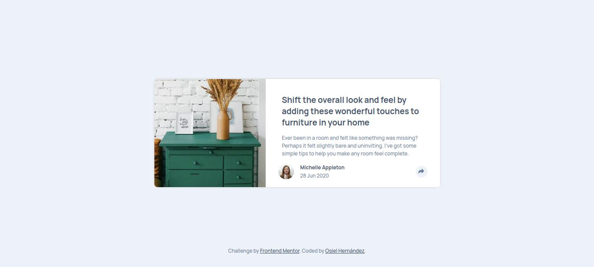

# Frontend Mentor - Article preview component solution

This is a solution to the [Article preview component challenge on Frontend Mentor](https://www.frontendmentor.io/challenges/article-preview-component-dYBN_pYFT). Frontend Mentor challenges help you improve your coding skills by building realistic projects. 

## Table of contents

- [Overview](#overview)
  - [The challenge](#the-challenge)
  - [Screenshot](#screenshot)
  - [Links](#links)
- [My process](#my-process)
  - [Built with](#built-with)
  - [What I learned](#what-i-learned)
  - [Useful resources](#useful-resources)
- [Author](#author)

## Overview

### The challenge

Users should be able to:

- View the optimal layout for the component depending on their device's screen size
- See the social media share links when they click the share icon

### Screenshot



Add a screenshot of your solution. The easiest way to do this is to use Firefox to view your project, right-click the page and select "Take a Screenshot". You can choose either a full-height screenshot or a cropped one based on how long the page is. If it's very long, it might be best to crop it.

### Links

- Solution URL: https://www.frontendmentor.io/solutions/article-preview-component-with-javascript-and-font-awesome-Slf_IvW9Md
- Live Site URL: https://xxosielxx.github.io/article-preview-component-challenge/

## My process

### Built with

- Semantic HTML5 markup
- CSS custom properties
- CSS Nesting
- Flexbox
- CSS Grid
- Mobile-first workflow
- [Font Awesome](https://fontawesome.com/) - Icon library

### What I learned

I'm very happy to have used CSS nesting. I was using it with SASS in a past project because I didn't know that it exist in CSS, but recently I found out and now I'm working faster.

I was using [Font Awesome](https://fontawesome.com/) too. I like this icon library. Is too easy to set icons with it. Just put something like: 
`<i class="fa-brands fa-x-twitter"></i>` 
and that's it, Twitter icon setted!

It was difficult to work with the image. I spent a lot of time on it.

The social networks container was difficult to work with, especially their styles in desktop. But hey, I learn how to make arrows with css...
```css
.share-container::before {
        content: "";
        position: absolute;
        left: 50%;
        bottom: -14px;
        margin-left: -16px;
        border-left: 16px solid transparent;
        border-right: 16px solid transparent;
        border-top: 16px solid var(--very-dark-grayish-blue);
}
```
and a nice transition...
```css
.share-container {
        transition: top .4s, opacity .4s;
}
```

### Useful resources

- [Perplexity](https://www.perplexity.ai/) - This is a great tool for online search purposes. Thanks to this AI I have been able to find the solution to my code problems very quickly.
- [Stackoverflow](https://stackoverflow.com/) - This is an excelent way to search for solutions. In this popular website I finded solutions to my code problems many times because I'm never the first to have a specific problem appear.

## Author

- Website - [Osiel Hernández](https://xxosielxx.github.io/osez-folio)
- LinkedIn - [Osiel Hernández](https://www.linkedin.com/in/osiel-hern%C3%A1ndez-rodr%C3%ADguez-9869612a1/)
- Github - [@xXOsielXx](https://github.com/xXOsielXx)
- Frontend Mentor - [@xXOsielXx](https://www.frontendmentor.io/profile/xXOsielXx)